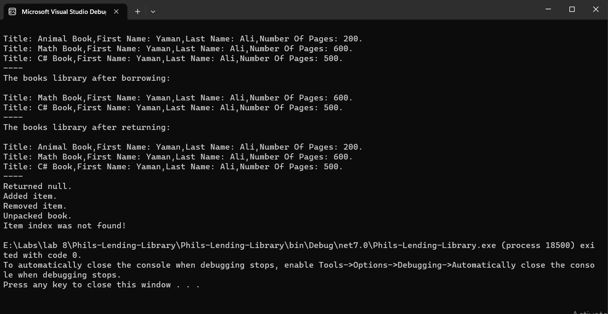

# Lab08 - Phills Lending Library

## What is this Lab talking about ? 
In this lab , we should construct a simple library system , that add , borrow , and returns books , to / from the library , We will use classes , interfaces and OOP principles (inheritance) to do our work , also there two methods that do the same as Add and Borrow , which are Pack and Unpack methods. 

## Visuals : 

## How to use the app ?
## Add a book :
To add a book , you can use Add method , that takes 4 parameters , which are title (string) , author first name (string) , author last name (string) and pages number (int) .

for Example: 
`Library book1 = new Library();` 
`book.Add("book1" , "yaman" , "ali" , 100);` 

## Borrow a book :
To borrow a book , you can use Borrow method , that takes 1 parameter , which is title .

for Example: 
`Book b = new Book();` 
`b = book1.Borrow("book1");` 

## Return a book :
To return a book , you can use Return method , that takes 1 parameter (Book) type.

for Example: 

`book1.Return(b);` 

## Pack a book :
To pack a book , you can use Pack method , that takes 1 parameter , which is Book (Book) type . 
for Example: 
`book1.Pack(b);` 

## UnPack a book :
To unpack a book , you can use Unpack method , that takes 1 parameter , which is Book (Book) type . 
for Example: 
`book1.Unpack(b);`
